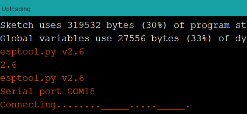

# WiFi Relay Controller

Create an ESP8266 Website to control up to 8 relays on our [XC4418](https://jaycar.com.au/p/XC4418) 8 Channel Relay Controller


Use relays effortlessly with this simple two-part setup! Simply connect any device you want to test or activate to the relay module; then use the in-built phone app to control them whenever you want. Set relays to toggle, timer, or momentary activation; and even set them go at certain times in the day. Great for automatic plant watering kits, testing devices, controlling lights or any other load up to 10 amps.

## Bill of Materials

| Qty | Code                                     | Description                |
| --- | ---------------------------------------- | -------------------------- |
| 1   | [XC4418](https://jaycar.com.au/p/XC4418) | 8 Channel Relay Controller |
| 1   | [XC4411](https://jaycar.com.au/p/XC4411) | Uno with WiFi              |

### You might also want

- Prototyping wires, Plug-Socket: [WC6028](https://jaycar.com.au/p/WC6028).
- Bootlace crimps, such as [PT4433](https://jaycar.com.au/p/PT4433) which work for connecting wires to the screw down terminals on the relay board
- Some mounting hardware, and or a box to put it in.

## Software Libraries

As always, you should have the `ESP8266` library installed in your Arduino IDE tool, along with the ESP8266 Data-Upload plugin. If not you can get either one from below:

- **ESP8266 Library**
  - Follow the instructions in the manual for the [XC3802](https://jaycar.com.au/p/XC3802) found in the download page on the jaycar website.
- **ESP8266 Data-Upload tool**
  - Instructions are found here: <https://github.com/esp8266/arduino-esp8266fs-plugin>

## System overview

This system is a pretty simple set up. As we know, the XC4411 is an UNO and ESP combined into a single board setup. The ESP portion will handle running a simple "web-app" type of program, which will then communicate with the UNO.


The UNO portion of the code will simply be responsible for activating and controlling the relays once it receives a command.

[XC4411](https://jaycar.com.au/p/XC4411) connects both the UNO and ESP together through the Serial port, which means we'll simply have to do some `Serial.read()` and `Serial.write()` to communicate between the two of them. To keep things simple we'll keep the data flow one way, so the ESP will never know how the relays look, which means the web-app will not be able to show what the actual relays look like, but we can make simple guesses.

## Integration and Assembly

This is a simple one-module build, thanks to the simplicity of the [XC4411](https://jaycar.com.au/p/XC4411) board.

### Wiring the relay controller


Simply connect 5V and GND to the top two pins of the relay board, ( you should find that they are labelled `VCC` and `GND`). Then connect all the other `IN#` pins to the digital pins of the UNO. To keep things simple, we keep the pins in order, starting from `Pin 2` and moving up to `Pin 9` - This will match what's on the relay board, starting from the bottom side.

It's a reasonable idea to keep the green tab between the `COM` and `GND` pins on the relay board as well.

### Programming the UNO

On the [XC4411](https://jaycar.com.au/p/XC4411) you should find the row of dip-switches. This is used to set what mode the device is in.


_(Ours is a little dirty due to how often we use it)._

For this section we will want to program the UNO side of things, so use a pen or otherwise to set the dip-switches as such:

| Pin   | 1   | 2   | 3   | 4   | 5   | 6   | 7   | 8   |
| ----- | --- | --- | --- | --- | --- | --- | --- | --- |
| State | OFF | OFF | **ON**  | **ON**  | OFF | OFF | OFF | OFF |

To upload, connect the UNO to your PC. Open your Arduino IDE, set the board to Arduino UNO. Set the PORT (check which COM your Arduino is connected to).
Then open up the `uno/uno.ino` portion of the code in the Arduino IDE editor, and upload. 

#### Testing the code (optional)

You should be able to test this side of things, by opening up the `Serial Monitor` and setting the options to:

- No Line endings
- `115200` baud

Then type in a command such as:

```plain
>4a
```

If you really want to debug the code, you should find some defines on line 10 and 11 of the uno code. The one on line 10 will output text similar to below.


The other define (on line 11) will do nothing, and will simply turn the relay on. You want line 11 defined when you finalise the project.

### Programming the ESP

Set the dip-switches as below.

| Pin   | 1   | 2   | 3   | 4   | 5   | 6   | 7   | 8   |
| ----- | --- | --- | --- | --- | --- | --- | --- | --- |
| State | OFF | OFF | OFF | OFF | **ON**  | **ON**  | **ON**  | OFF |

For this portion you need to open up the esp/esp.ino code in the Arduino IDE, and change the board type to `Generic ESP8266` board.

Change the "Flash Size" of the program to be `4M (3M SPIFFS)` - this will portion off some of the code so we can fit in our `data/` folder. You will find our website code in the data folder, which we want to put all of it onto the ESP. Below is a screenshot of our settings.


Firstly, upload the code as normal. If you press upload and you find that the IDE is failing to upload, or you get some output like this:



This just means that the IDE is waiting for the ESP to reboot. Press the `RESET` button on the board when you see the IDE show this message. It should upload without a hitch.

Once the code is done, use the `ESP Data Upload Tool` (as highlighted in the image above) to upload our website onto the ESP. You will have to press the reset button similar to before. Once it is programmed, you can switch off the **dip-switch 7** and open the serial monitor to see what output the ESP has when you connect to the _"Relay Controller"_ hotspot and navigate to <http://192.168.4.1> - or just continue on.

#### Testing the ESP code (optional)

Similar to the uno code, we have another bunch of defines for debugging. you can enable or disable the debug messages this way.

Some important things to remember, when changing the code:

- Always keep `Flash size` the same. If you change it, you will have to re-upload both the code and the website.
- When uploading, you must turn **dip-switch 7** to be **ON**. Then turn it _OFF_ when you want to interact with the Serial Monitor and the ESP.
- If you change website code, you will have to use the data upload tool to copy it onto the flash, Still with the dip-switch 7 on.

### Bringing it all together

Once the two halves are programmed, Finally switch the dip switches to the below.

| Pin   | 1   | 2   | 3   | 4   | 5   | 6   | 7   | 8   |
| ----- | --- | --- | --- | --- | --- | --- | --- | --- |
| State | **ON**  | **ON**  | OFF | OFF | OFF | OFF | OFF | OFF |

This will connect the Serial of the ESP to the Serial of the UNO. Now it is only powered by USB and the Serial Monitor will not be connected to anything.

## Use

Open up your phone's WiFi and reboot the [XC4411](https://jaycar.com.au/p/XC4411) - You should find that there is a new wireless network called "Relay Controller". Connect to it, then open up the browser and go to: <http://192.168.4.1>


The website isn't much to look at, but it works. You should be able to press buttons and find the relays turned on and off. If you know how to make a website look good and want to have a shot of making this look better, have a go of developing a new `data/` folder and submit it on the github issues tab, or [fork the repo][fork] and [submit a pull request][pull].

### Debugging when things go wrong

If you find some things not working, connect your computer to the network ( alternatively, connect the ESP to your home network) and open up the website on your computer. You should be able to open up the "Chrome Inspector Tool" and find a console that will output messages.

A sure-fire way to test what is happening however, is to connect the Serial Monitor to the device ( with the dip-switches corresponding to what section you're testing) and test each portion of the code as you require.

- For instance, you should find that with the uno code, sending `>3a` turns on relay 3, and `>3d` turns off relay 3.
- Similarly, with the ESP code, pressing on the "Turn On Relay 1" button, you should get a `>1a` command output on the Serial Monitor.

## Future Improvements and Code Discussion

Obviously the website needs work, but any number of changes can happen to this project. You should still have some pins free and all you would have to do to add something is:

- add a button to the website data.
- make the button **fetch** a page, similar to how the relays are done.
- build in that code on the ESP, to send the right command to the uno.
- program the uno to accept the code and interpret it.

### How the code works: Relays

Below are some code segments to explain.

### Website Button

On the website is a button that we use to turn the relay on, it's a simple `<button id='3' class='relay'></button>` element which has the ID of what pin it is (not entirely, but close enough for this example).

Then we have some javascript code (simplified):

```javascript
$("button.relay").on("click", function() {
  //do this when a button with the class 'relay' is clicked
});
```

In this function we `fetch()` a new web-page, which points to `/relay`, and if the return status is ok, we add the class "isOn" to the button:

```javascript
fetch("relay?relay=3&mode=activate").then(response => {
  if (response.status == 200) {
    button.addClass("isOn");
  }
});
```

This means the website will be trying to access a new web page at `http://192.168.4.1/relay` with the parameters of `?relay=3&mode=activate`. Let's check out the ESP code:

```cpp
  //firstly, set the handler function in the setup():
  server.on("/relay", handleRelayCommand);

  // ... later ...

  void handleRelayCommand(){
    String relayNumber = server.arg("relay");
    String mode = server.arg("mode");
    // ...
  }
```

The command `server.arg("relay");` simply gets whatever the argument "relay" has been set to. In our original request: `?relay=3&mode=activate` this will be the string `"3"`. Similarly, the mode argument is set to a string `"activate"`

We then simply do some checks, find what relay the `"3"` corresponds to and whether `"activate"` means we are turning on the relay, and send that as a command to the UNO:

```cpp
Serial.write('>'); //start of command
Serial.write('3'); //relay 3
Serial.write('a'); //activate, or turn on
```

This will be interpreted by the UNO, which will then actually turn the relay on:

In the UNO.ino (again, simplified):

```cpp
  while(Serial.read() != '>') //do nothing until we get '>'
    continue;

  char relay = Serial.read(); //next character is relay;
  char mode = Serial.read(); //next character is mode;

  // ... do some checks, turn char into int, see if it's valid, etc.

  digitalWrite(theRelay, theMode);
```

One thing to note is that data-flow is only one direction in this code, There is no `Serial.write()` on the UNO to be `Serial.read()` by the ESP.

## Further reading

- JQuery
  - [Tutorials and Interactive demos, and exercises](https://www.w3schools.com/jquery/)
- Github Repos
  - [Git basics](https://git-scm.com/book/en/v1/Getting-Started-Git-Basics)
  - [visual git guide](http://marklodato.github.io/visual-git-guide/index-en.html)
  - [Forking a repository][fork]
  - [Submitting a pull request][pull]
- ESP8266 SPIFFS
  - [SPIFFS API](http://arduino.esp8266.com/Arduino/versions/2.0.0/doc/filesystem.html)

[fork]: https://help.github.com/en/github/getting-started-with-github/fork-a-repo
[pull]: https://help.github.com/en/github/collaborating-with-issues-and-pull-requests/creating-a-pull-request#creating-the-pull-request
